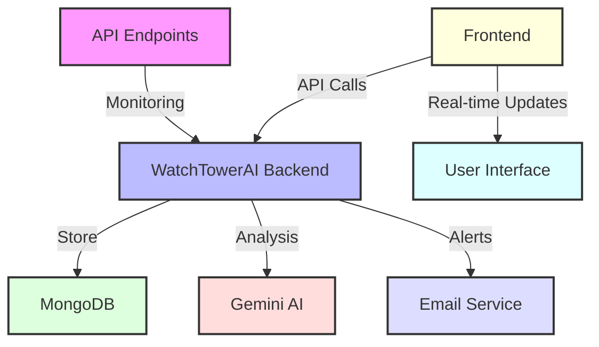

# 🎯 WatchTowerAI

<div align="center">


[](https://fastapi.tiangolo.com)
[](https://nextjs.org)
[](https://www.mongodb.com)
[](https://www.typescriptlang.org)
[](https://www.python.org)
[](https://deepmind.google/technologies/gemini/)

**An AI-powered API monitoring and alerting system with real-time insights and intelligent remediation**

[Explore Demo](https://demo.watchtowerai.com) · [Report Bug](https://github.com/lohitkolluri/WatchTowerAi/issues) · [Request Feature](https://github.com/lohitkolluri/WatchTowerAi/issues)

</div>

---

## 🌟 Features

<div align="center">

| Feature | Description |
|---------|-------------|
| 🤖 AI-Powered Analysis | Real-time log analysis and classification using Google Gemini AI |
| 🔍 Universal API Monitoring | Automated monitoring for any API endpoint |
| ⚡ Real-time Alerts | Instant notifications with AI-generated remediation suggestions |
| 📊 Advanced Analytics | Comprehensive metrics and performance tracking |
| 🔎 Smart Log Search | Powerful querying with type, tags, and confidence filtering |
| 📨 Email Notifications | Beautifully formatted HTML email alerts |

</div>

---

## 🏗️ Architecture



---

## 🚀 Tech Stack

### Backend
- **Framework:** FastAPI
- **Database:** MongoDB with Motor (AsyncIO)
- **AI Integration:** Google Gemini API
- **Logging:** Loguru
- **Email:** SMTP via aiosmtplib
- **Validation:** Pydantic v2

### Frontend
- **Framework:** Next.js 15
- **UI Components:** Radix UI
- **Styling:** TailwindCSS
- **State Management:** TanStack Query
- **Charts:** Recharts
- **Forms:** React Hook Form + Zod
- **Animations:** Framer Motion

---

## 📂 Project Structure

```plaintext
WatchTowerAI/
├── Backend/
│   ├── app/
│   │   ├── services/
│   │   │   ├── email_alert.py
│   │   │   ├── gemini.py
│   │   │   ├── log_classifier.py
│   │   │   └── log_processor.py
│   │   ├── config.py
│   │   ├── database.py
│   │   ├── main.py
│   │   ├── models.py
│   │   └── schemas.py
│   ├── email_templates/
│   └── requirements.txt
│
├── Frontend/
    ├── src/
    ├── public/
    ├── components.json
    ├── tailwind.config.js
    ├── next.config.js
    └── package.json
```

---

## 🛠️ Getting Started

### Prerequisites
- Python 3.9+
- Node.js 18+
- MongoDB
- SMTP Server
- Google Gemini API Key

### Backend Setup
```bash
# Clone repository
git clone https://github.com/lohitkolluri/WatchTowerAi
cd WatchTowerAi/Backend

# Setup virtual environment
python -m venv env
source env/bin/activate  # Linux/Mac
# or
.\env\Scripts\activate  # Windows

# Install dependencies
pip install -r requirements.txt

# Configure environment
cp .env.example .env
# Edit .env with your configurations

# Start server
uvicorn app.main:app --reload
```

### Frontend Setup
```bash
cd ../Frontend

# Install dependencies
npm install

# Configure environment
cp .env.development .env.local
# Edit .env.local with your configurations

# Start development server
npm run dev
```

Visit `http://localhost:3000` for the frontend and `http://localhost:8000/docs` for the API documentation.

---

## 📡 API Endpoints

| Method | Endpoint | Description |
|--------|----------|-------------|
| POST | `/ingest` | Log ingestion endpoint |
| GET | `/logs` | Retrieve and query logs |
| GET | `/alerts` | List all alerts |
| PATCH | `/alerts/{id}` | Update alert status |
| GET | `/metrics` | Service metrics |
| POST | `/monitor/api` | Register API for monitoring |
| GET | `/health` | Health check endpoint |

---

## 🔐 Security

- API Key Authentication
- OAuth2 Support
- Environment-based Configurations
- Secure Email Templates
- Rate Limiting
- Input Validation

---

## 📈 Performance

- Asynchronous Operations
- Efficient Database Queries
- Optimized Frontend Bundles
- Lazy Loading Components
- Image Optimization
- Response Caching

---

## 🤝 Contributing

1. Fork the Project
2. Create your Feature Branch (`git checkout -b feature/AmazingFeature`)
3. Commit your Changes (`git commit -m 'Add some AmazingFeature'`)
4. Push to the Branch (`git push origin feature/AmazingFeature`)
5. Open a Pull Request

---

## 📃 License

Distributed under the MIT License. See `LICENSE` for more information.

---

## 📞 Contact

Lohit Kolluri - [me@lohit.is-a.dev](mailto:me@lohit.is-a.dev)

Project Link: [https://github.com/lohitkolluri/WatchTowerAi](https://github.com/lohitkolluri/WatchTowerAi)

---

<div align="center">

Made with ❤️ by [Lohit Kolluri](https://github.com/lohitkolluri)

⭐ Star us on GitHub — it motivates us a lot!

</div>