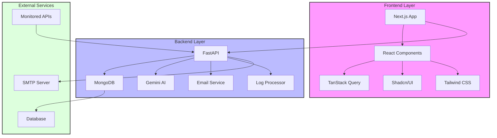
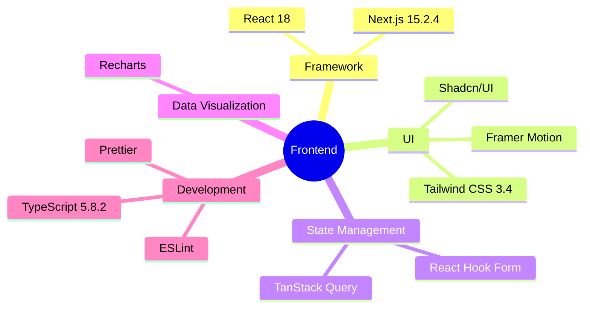
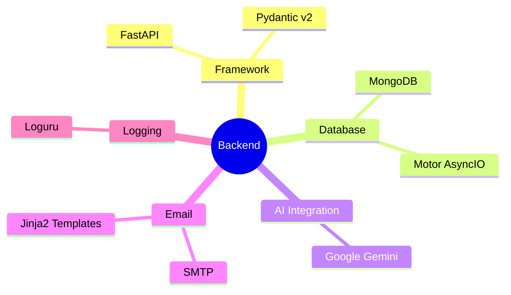

# 🚨 WatchTowerAI

<div align="center">
  

  <h1>AI-Powered API Monitoring & Alerting Platform</h1>

  [](https://nextjs.org)
  [](https://fastapi.tiangolo.com)
  [](https://www.mongodb.com)
  [](https://www.typescriptlang.org)
  [](https://www.python.org)
  [](https://deepmind.google/technologies/gemini/)
  [](https://tailwindcss.com)
  [](LICENSE)

  <p align="center">
    <a href="#-features">Features</a> •
    <a href="#-architecture">Architecture</a> •
    <a href="#-installation">Installation</a> •
    <a href="#-documentation">Documentation</a> •
    <a href="#-contributing">Contributing</a>
  </p>
</div>

## 🌟 Features

<div align="center">

### Core Capabilities

| Feature | Description |
|---------|-------------|
| 🤖 AI Analysis | Real-time log analysis using Google Gemini AI |
| 🔍 Universal Monitoring | Automated monitoring for any API endpoint |
| ⚡ Real-time Alerts | Instant notifications with AI remediation |
| 📊 Advanced Analytics | Comprehensive metrics and visualization |
| 🔎 Smart Search | Advanced log querying and filtering |
| 📨 Email Alerts | Beautiful HTML email notifications |

</div>

## 🏗️ Architecture



## 💻 Tech Stack

### Frontend Technologies


### Backend Technologies


## 📂 Project Structure

<details>
<summary>Click to expand project structure</summary>

```plaintext
WatchTowerAI/
├── Frontend/
│   ├── src/
│   │   ├── app/              # Next.js pages
│   │   ├── components/       # React components
│   │   ├── lib/             # Utilities
│   │   └── styles/          # Global styles
│   ├── public/              # Static assets
│   ├── tailwind.config.js   # Tailwind configuration
│   ├── next.config.js       # Next.js configuration
│   └── package.json         # Dependencies
│
├── Backend/
│   ├── app/
│   │   ├── services/
│   │   │   ├── email_alert.py
│   │   │   ├── gemini.py
│   │   │   ├── log_classifier.py
│   │   │   └── log_processor.py
│   │   ├── config.py
│   │   ├── database.py
│   │   ├── main.py
│   │   ├── models.py
│   │   └── schemas.py
│   ├── email_templates/
│   └── requirements.txt
```

</details>

## 🚀 Installation

### Prerequisites

- Python 3.9+
- Node.js 18+
- MongoDB
- SMTP Server
- Google Gemini API Key

### Backend Setup

```bash
# Clone repository
git clone https://github.com/lohitkolluri/WatchTowerAi
cd WatchTowerAi/Backend

# Create virtual environment
python -m venv venv
source venv/bin/activate  # Linux/Mac
# or
.\venv\Scripts\activate  # Windows

# Install dependencies
pip install -r requirements.txt

# Configure environment
cp .env.example .env
# Edit .env with your configurations

# Start server
uvicorn app.main:app --reload
```

### Frontend Setup

```bash
cd ../Frontend

# Install dependencies
npm install

# Configure environment
cp .env.development .env.local

# Start development server
npm run dev
```

## 📡 API Documentation

### Core Endpoints

| Method | Endpoint | Description | Authentication |
|--------|----------|-------------|----------------|
| POST | `/ingest` | Log ingestion | API Key |
| GET | `/logs` | Retrieve logs | API Key |
| GET | `/alerts` | List alerts | Bearer Token |
| PATCH | `/alerts/{id}` | Update alert | Bearer Token |
| GET | `/metrics` | Service metrics | API Key |
| POST | `/monitor/api` | Register API | API Key |
| GET | `/health` | Health check | None |

## 🔐 Security

### Authentication Methods

- **API Key Authentication**
  - Header: `X-API-Key`
  - Used for: Metrics, Log ingestion

- **Bearer Token Authentication**
  - Header: `Authorization`
  - Used for: Alert management

### Environment Configuration

```env
# Backend (.env)
API_KEY=your_api_key
AUTH_TOKEN=your_auth_token

# Frontend (.env.local)
NEXT_PUBLIC_API_KEY=your_api_key
NEXT_PUBLIC_AUTH_TOKEN=your_auth_token
```

## 📈 Performance Features

### Frontend Optimization
- Code splitting via Next.js
- Image optimization
- Tailwind CSS purging
- React Query caching
- Lazy loading components

### Backend Optimization
- Asynchronous operations
- Connection pooling
- Response caching
- Rate limiting
- Background tasks

## 🧪 Testing

### Frontend Testing
- Jest for unit tests
- React Testing Library
- Cypress for E2E
- Lighthouse for performance

### Backend Testing
- PyTest for unit tests
- AsyncIO testing
- Integration tests
- Load testing

## 📱 Responsive Design

- Mobile-first approach
- Breakpoint optimization
- Touch-friendly interfaces
- Progressive enhancement
- Flexible layouts

## 🎨 Theme Support

- Light/Dark modes
- Custom color schemes
- Consistent UI components
- Accessible design
- RTL support

## 🤝 Contributing

1. Fork the repository
2. Create your feature branch
   ```bash
   git checkout -b feature/AmazingFeature
   ```
3. Commit your changes
   ```bash
   git commit -m 'Add some AmazingFeature'
   ```
4. Push to the branch
   ```bash
   git push origin feature/AmazingFeature
   ```
5. Open a Pull Request

## 📃 License

This project is licensed under the MIT License - see the [LICENSE](LICENSE) file for details.

## 👨‍💻 Author

**Lohit Kolluri**
- Email: [me@lohit.is-a.dev](mailto:me@lohit.is-a.dev)
- GitHub: [@lohitkolluri](https://github.com/lohitkolluri)

---

<div align="center">

### ⭐ Star us on GitHub — it motivates us a lot!

Made with ❤️ by [Lohit Kolluri](https://github.com/lohitkolluri)

</div>