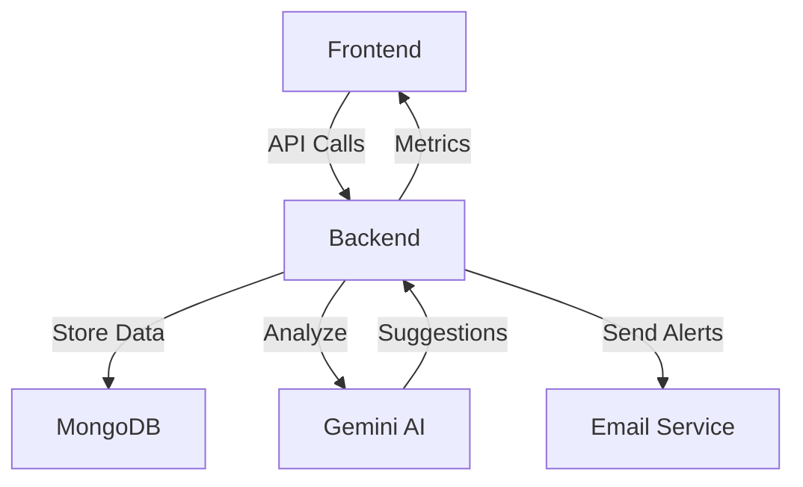
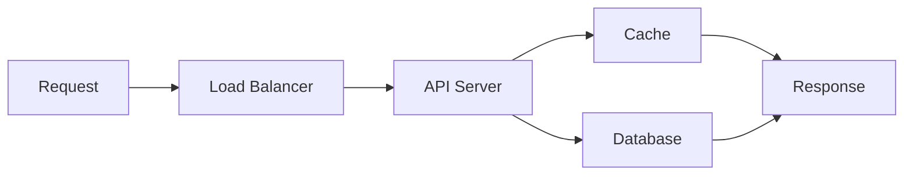

# 🚨 WatchTowerAI - AI-Powered API Monitoring Platform

<div align="center">


[](https://opensource.org/licenses/MIT)
[](https://eslint.org/)
[](https://www.typescriptlang.org/tsconfig#strict)

</div>

## 📖 Overview

WatchTowerAI is a comprehensive, AI-powered API monitoring and alerting platform that combines a modern Next.js frontend with a robust FastAPI backend. The platform provides real-time monitoring, anomaly detection, and intelligent alerting for API endpoints, powered by Google's Gemini AI for advanced analysis and remediation suggestions.

<div align="center">



</div>

## 🌟 Key Features

- **Universal API Monitoring**: Monitor any API endpoint with real-time performance tracking
- **AI-Powered Analysis**: Gemini AI integration for intelligent log analysis and anomaly detection
- **Real-time Alerting**: Instant notifications with actionable AI-generated suggestions
- **Modern Dashboard**: Beautiful, responsive UI with real-time metrics and analytics
- **Advanced Log Management**: Powerful search and filtering capabilities
- **Email Notifications**: Structured, formatted alerts with remediation steps
- **Comprehensive Metrics**: Real-time and historical performance analytics

## 🔧 Tech Stack

### Frontend
- **Framework**: Next.js 15 with App Router
- **Language**: TypeScript
- **Styling**: TailwindCSS with custom components
- **State Management**: React Query
- **UI Components**: Radix UI + Custom Components
- **Form Handling**: React Hook Form + Zod
- **Charts**: Recharts
- **Animations**: Framer Motion

### Backend
- **Framework**: FastAPI
- **Database**: MongoDB with Motor (AsyncIO)
- **AI Integration**: Google Gemini API
- **Email Service**: SMTP via aiosmtplib
- **Logging**: Loguru
- **Data Validation**: Pydantic v2

## 📂 Project Structure

### Backend Structure
```plaintext
Backend/
├── app/
│   ├── services/              # Core business logic services
│   │   ├── email_alert.py     # Email notification service
│   │   ├── gemini.py          # Gemini AI integration
│   │   ├── log_classifier.py  # AI-powered log classification
│   │   └── log_processor.py   # Log processing logic
│   ├── config.py              # Configuration management
│   ├── database.py            # MongoDB connection setup
│   ├── main.py                # FastAPI application entry
│   ├── models.py              # Database models
│   └── schemas.py             # Pydantic validation schemas
├── email_templates/           # Email notification templates
│   ├── alert_email.html       # Alert notification template
│   └── notification_email.html # General notification template
├── .env                       # Environment variables
├── .env.example               # Environment variables template
└── requirements.txt           # Python dependencies
```

### Frontend Structure
```plaintext
Frontend/
├── src/
│   ├── app/                   # Next.js app router pages
│   │   ├── alerts/           # Alerts management page
│   │   ├── analytics/        # Analytics dashboard
│   │   ├── api/              # API routes
│   │   ├── dashboard/        # Main dashboard
│   │   ├── endpoints/        # Endpoint management
│   │   ├── logs/            # Log viewer
│   │   ├── services/        # Services management
│   │   └── settings/        # Application settings
│   ├── components/           # Reusable UI components
│   │   ├── endpoints/       # Endpoint-related components
│   │   ├── layouts/         # Layout components
│   │   ├── services/        # Service-related components
│   │   └── ui/              # Base UI components (Radix UI)
│   ├── lib/                  # Utility functions
│   │   ├── api.ts           # API client
│   │   ├── environments.ts  # Environment config
│   │   └── utils.ts         # Helper functions
│   ├── services/            # Frontend services
│   │   ├── serviceService.ts # Service management
│   │   └── settingsService.ts # Settings management
│   └── types/               # TypeScript type definitions
├── public/                  # Static assets
│   ├── favicon.ico
│   ├── image.png
│   ├── logo.png
│   └── manifest.json
├── .env.development         # Development environment
├── .env.production          # Production environment
├── components.json          # UI components configuration
├── next.config.js           # Next.js configuration
├── tailwind.config.js       # Tailwind CSS configuration
└── tsconfig.json            # TypeScript configuration
```

### Key Components

#### Backend Services
- **Email Alert Service**: Handles email notifications with customizable templates
- **Gemini AI Service**: Integrates with Google's Gemini AI for log analysis
- **Log Classifier**: AI-powered log classification and entity extraction
- **Log Processor**: Processes and stores log data efficiently

#### Frontend Pages
- **Dashboard**: Main overview with real-time metrics
- **Alerts**: Alert management and monitoring
- **Analytics**: Performance analytics and trends
- **Endpoints**: API endpoint management
- **Logs**: Log viewer with advanced filtering
- **Services**: Service management interface
- **Settings**: Application configuration

#### UI Components
- **Radix UI Components**: Accessible base components
- **Custom Components**: Project-specific UI elements
- **Layout Components**: Page layouts and navigation
- **Service Components**: Service-specific UI elements

## 🚀 Getting Started

### Prerequisites

- Node.js 18+ and npm/bun
- Python 3.9+
- MongoDB
- Google Gemini API key
- SMTP server credentials

### Installation

1. **Clone the repository**
   ```bash
   git clone https://github.com/lohitkolluri/WatchTowerAi
   cd WatchTowerAi
   ```

2. **Setup Frontend**
   ```bash
   cd Frontend
   npm install
   cp .env.example .env
   # Edit .env with your configuration
   ```

3. **Setup Backend**
   ```bash
   cd Backend
   python -m venv venv
   source venv/bin/activate  # or `venv\Scripts\activate` on Windows
   pip install -r requirements.txt
   cp .env.example .env
   # Edit .env with your configuration
   ```

4. **Start Development Servers**
   ```bash
   # Terminal 1 - Backend
   cd Backend
   uvicorn app.main:app --reload

   # Terminal 2 - Frontend
   cd Frontend
   npm run dev
   ```

## 📡 API Documentation

### Core Endpoints

| Method | Endpoint | Description |
|--------|----------|-------------|
| `POST` | `/api/ingest` | Ingest new log data |
| `GET` | `/api/logs` | Retrieve filtered logs |
| `GET` | `/api/alerts` | Get active alerts |
| `PATCH` | `/api/alerts/{id}` | Update alert status |
| `GET` | `/api/metrics` | Get service metrics |
| `POST` | `/api/monitor` | Add new API endpoint to monitor |

### Authentication

The API supports two authentication methods:
1. **API Key**: Include in `X-API-Key` header
2. **OAuth2**: Token-based authentication via `/token` endpoint

## 🎯 Features in Detail

### AI-Powered Monitoring
- Real-time anomaly detection using Gemini AI
- Automatic log classification and entity extraction
- Intelligent alert prioritization
- AI-generated remediation suggestions

### Dashboard Features
- Real-time metrics visualization
- Interactive log filtering and search
- Alert management interface
- Performance trend analysis
- Customizable monitoring rules

### Alert System
- Configurable alert thresholds
- Multiple notification channels
- Alert acknowledgment workflow
- Historical alert tracking
- Custom alert templates

### Data Management
- Efficient log storage and retrieval
- Automatic data retention policies
- Export capabilities
- Backup and restore functionality

## 🛡️ Security Features

- API key authentication
- OAuth2 support
- Rate limiting
- Input validation
- CORS protection
- Secure headers
- Environment-based configuration

## 📈 Performance

<div align="center">



</div>

- Asynchronous processing
- Caching layer
- Connection pooling
- Optimized database queries
- Efficient log storage
- Background task processing

## 📝 License

This project is licensed under the MIT License - see the [LICENSE](LICENSE) file for details.
